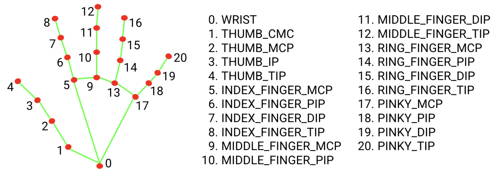

# Rock Paper Scissors
(This is a toy project made in September 2021, refactored for upload to GitHub, rely on mediapipe version from that time)

This repo contain experimentations with what's possible with the library [Mediapipe](https://developers.google.com/mediapipe/solutions/guide).
Here we are using the hand landmarks module to detect below landmarks on the hand showed at the camera : 


Those landmarks are then stored in a CSV. The dimension reduction of the problem allow us to then train a basic machine learning problem to recognize hand position.
The main usage being to play against our webcam the game of rock, paper, scissors and "lose" every time, the computer guessing what we play almost instantly and displaying the winning choice.

## How to use
* Build the environment : ```conda env create -f environment.yml```  
* Create the dataset by launching ```src/trainingSetBuilder.py```. This will prompt you with the feed returned by your webcam, asking you in loops to provide the configured hand positions you specified in ```src/configs/config.py``` and ```src/configs/dataset_builder_config.yml```. This will output a CSV, with each line being the position of the hand on one frame, with the accorded class one hot encoded at the end  
* Then launch the training script ```src/train.py```. Configuration for training can be found in ```src/configs/training_config.yml```  
* You are now ready to lose by launching ```src/main.py```  

## Possible improvements
* Use landmarks position relative to base of the hand to account for scale changes
* Handling multiple hands on camera view

## More work
```exploratory/``` contains :
* a ```main.py``` script to display a picture of a rock when building a fist and displaying a picture of a brick wall to censore your middle finger
* a ```volumeControl.py``` script to control the volume of your computer based on the space between your thumb and index (works for Linux only, as it rely on system calls)